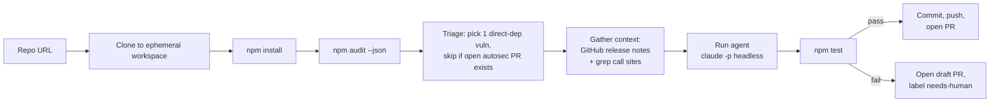
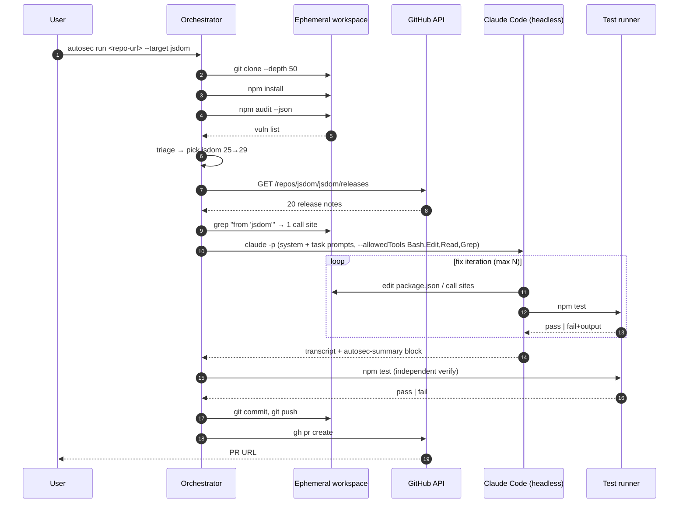
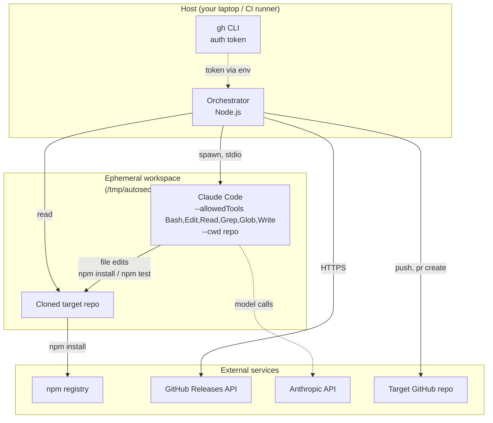
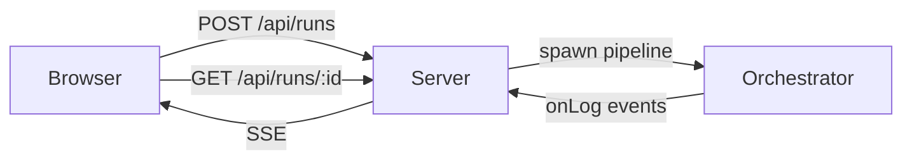

# AutoSec

> **Autonomous dependency-vulnerability remediation agent** — scans, fixes, and ships PRs without a human in the loop until review.

AutoSec is an opinionated prototype that closes the last-mile gap left by tools like Dependabot, Snyk, and `npm audit`: those tools tell you *that* a dependency is vulnerable and *which version* fixes it. AutoSec actually performs the bump **and** the call-site migration when the fix is a breaking major-version change, then opens a PR with the diff, the changelog, and the agent's own migration notes.

The novel part is not detection. It is the **fix loop** for major-version bumps — the part that today still requires a human to read changelogs, refactor call sites, and chase test failures.

---

## Why this exists

Modern security tooling produces a high-quality alert stream. Engineers still spend disproportionate time *converting alerts into merged PRs* — especially when the fix requires a major-version bump that breaks call sites. Dependabot opens the PR, but if anything broke, the PR sits red for weeks until someone with context picks it up.

AutoSec assumes:

- The boring deterministic parts (scan, triage, branch, push, PR) should be **dumb code**.
- The judgment-heavy parts (read changelogs, decide what call sites are affected, edit them, iterate against tests) should be **an LLM agent**.
- The agent must operate inside a **strict allowlist** with a **test suite as oracle**, or it should refuse to act.

One vulnerability per PR. Reviewability is the product.

---

## How it works

### Pipeline



### Stages, in detail

| Stage | Module | What it does | Tool used |
|---|---|---|---|
| Scan | `src/scan.js` | Run `npm audit --json`, normalize to `{package, current, fixed, severity, isMajorBump}` | `npm` |
| Triage | `src/triage.js` | Prefer direct deps over transitive, sort by severity, dedupe against open `autosec/*` PRs | `gh pr list` |
| Context | `src/context.js` | Fetch GitHub release notes between current and fixed versions; `grep` repo for call sites of the package | GitHub API + `grep` |
| Agent | `src/agent.js` | Spawn Claude Code headless inside the clone with a strict allowlist and prompt; capture transcript and parse the agent's structured summary | `claude -p` |
| Verify | `src/verify.js` | Run the repo's own `npm test` independently of the agent's iterations | `npm` |
| PR | `src/pr.js` | Branch, commit, push (auth via `gh auth token`), open PR with templated body | `git`, `gh` |

### Data flow



### Trust boundary



The agent never sees host paths outside the clone. The orchestrator never blindly trusts the agent's claim of success — it re-runs `npm test` itself after the agent finishes.

---

## Quick start

### Prereqs

- Node 20+ (canvas-style native deps need prebuilts that are reliable on 20)
- `git`, `npm`, `gh` (authenticated; `gh auth status` should be green)
- `claude` CLI on PATH, authenticated (Anthropic API, Bedrock, or `claude /login`)
- macOS only: `brew install pkg-config jpeg librsvg cairo pango giflib libpng` if your target repo has native deps like `canvas`

### Install

```bash
git clone https://github.com/<your-user>/autosec
cd autosec
./scripts/install-hooks.sh   # sets core.hooksPath=.githooks (secret-scan pre-commit)
npm install
```

### Web UI

```bash
npm run serve   # http://127.0.0.1:8787
```

The UI exposes the full pipeline interactively: paste a repo URL, optionally pin a target package, watch pipeline events stream live (Server-Sent Events), and see the agent's stdout in a side pane. The final card shows status, target details, agent migration notes, files touched, diffstat, and call sites.

For safety, **the UI never pushes or opens a PR** — it always runs with `push=false`. Use the CLI when you actually want to ship a PR.



API surface:

| Endpoint | Use |
|---|---|
| `POST /api/runs` | start a run; returns `{runId}` |
| `GET /api/runs/:id/events` | Server-Sent Events stream of pipeline events + agent stdout chunks |
| `GET /api/runs/:id` | poll final state (status, result, error) |
| `GET /api/health` | liveness |

### CLI

```bash
# Dry run — scan + triage + context only. Nothing is edited or pushed.
./bin/autosec.js run https://github.com/<owner>/<repo> --dry-run

# Pick a specific vuln (must appear in scan results)
./bin/autosec.js run https://github.com/<owner>/<repo> --target jsdom

# Full run, no push (commits locally for inspection)
./bin/autosec.js run https://github.com/<owner>/<repo> --target jsdom --no-push

# Full run, push + open PR
./bin/autosec.js run https://github.com/<owner>/<repo> --target jsdom

# Tweak iteration cap (default 5)
./bin/autosec.js run https://github.com/<owner>/<repo> --max-iters 3
```

Useful environment variables:

- `AUTOSEC_NPM_REGISTRY=https://registry.npmjs.org/` — override registry for the cloned target's `npm install` (helpful on machines with a different default registry)
- `GITHUB_TOKEN` or `GH_TOKEN` — used for higher GitHub API rate limits and authenticated push; falls back to `gh auth token` if unset

### Container option

A `Dockerfile` and `run-docker.sh` are included for clean-room execution. Note: Claude CLI auth needs to be plumbed into the container (Anthropic API key via env, Bedrock via AWS env credentials, or volume-mount of the host `~/.claude`).

---

## Repository layout

```
autosec/
├── bin/
│   ├── autosec.js          # CLI entry point (commander)
│   └── autosec-server.js   # web server entry
├── src/
│   ├── orchestrator.js     # 5-stage pipeline (with onLog hook for streaming)
│   ├── scan.js             # npm audit --json → normalized
│   ├── triage.js           # pick best target, dedupe vs. open PRs
│   ├── context.js          # release notes + call-site discovery
│   ├── agent.js            # spawn claude -p headless
│   ├── verify.js           # independent npm test
│   ├── pr.js               # branch/commit/push/PR
│   └── server.js           # Express + SSE server
├── web/
│   └── index.html          # single-page UI (Tailwind CDN, no build step)
├── prompts/
│   ├── system.md           # agent constraints (the leverage point)
│   └── task.md             # per-run interpolated task description
├── .githooks/pre-commit    # secret-pattern + forbidden-path scanner
├── scripts/install-hooks.sh
├── Dockerfile              # clean-room runtime (node 20, gh, claude, native libs)
├── run-docker.sh           # docker run wrapper
└── demo/README.md          # how to pick / prepare a demo target
```

---

## Live demo (what we observed)

Target: `smankoo/rdr-next`. Chosen vuln: `jsdom 25.0.0 → 29.1.1` (high severity, direct dep, major bump). One call site (`app/api/bypassPaywall/route.ts`).

The agent:

1. Updated `package.json` from `^25.0.0` → `^29.1.1`.
2. Ran `npm install --legacy-peer-deps` because jsdom v29 declares `canvas@^3` as `peerOptional` while the repo pins `canvas@^2.11.2`.
3. Read all 20 release notes between v25 and v29 (CSSOM rewrite, virtualConsole rename, fetch bad-port blocking, resource-loader API overhaul).
4. Identified that the only call site uses `new JSDOM(html)` plus `querySelector` / `getElementById` / `innerHTML` — all unaffected by the breaking changes.
5. Concluded **no code edits were required**, ran tests, and emitted a structured summary.

Run time: ~95 seconds end-to-end. Agent wall-clock inside the loop: ~76 seconds. Diff: `package.json` + `package-lock.json`.

The honest moment: the test suite had a pre-existing TS error (`screen` not exported from `@testing-library/react`) unrelated to the bump. The agent reported `status: partial` rather than claiming success, and the orchestrator opened the PR as a draft labeled `needs-human`. That's the right behavior — the system refuses to claim correctness when the oracle is broken.

---

## Guardrails

| Risk | Mitigation |
|---|---|
| Agent edits files outside the repo | `--cwd <clone>`, ephemeral path under `os.tmpdir()` |
| Agent runs arbitrary tools | `--allowedTools Bash,Edit,Read,Grep,Glob,Write` (no MCP, no web fetch beyond what bash permits) |
| Agent loops forever | `--max-turns` cap, 10-minute wall clock |
| Agent claims false success | Orchestrator runs `npm test` independently after agent exits |
| No oracle = silent breakage | Refuses to invoke the agent if `package.json` lacks a `test` script |
| Scope creep in PR | System prompt forbids unrelated edits, dependency drift, lint/CI/test config changes |
| Multiple PRs for the same bump | Triage skips vulns where an `autosec/<pkg>-<ver>` branch already has an open PR |
| Secrets accidentally committed | Pre-commit hook scans staged files for token shapes and forbidden paths |

---

## Productization roadmap

This is a working prototype. The path from prototype to product, ordered by where leverage compounds:

### Phase 1 — Reliability (1–2 weeks)

- **Multi-language support.** Today: npm only. Add `pip-audit` (Python), `osv-scanner` (Go, Rust, multi), `bundle-audit` (Ruby). Each is a thin scan-stage adapter; everything downstream is language-agnostic if `testCommand` is generalized.
- **Oracle pluggability.** Accept `tsc --noEmit`, `cargo check`, `go test`, build commands as oracles when `npm test` is missing. Document a precedence order.
- **Lockfile resolution strategies.** Today the agent gets to choose `--legacy-peer-deps`. Codify the policy: try strict resolution first, fall back with explicit acknowledgement in the PR body.
- **Better changelog retrieval.** GitHub releases is one of three useful sources (also: `CHANGELOG.md` in the repo, git log between tags). Add fallbacks; cache aggressively.
- **Flaky-test detection.** Run `npm test` twice when it fails; if the failure is non-deterministic, surface that in the PR body instead of marking partial.

### Phase 2 — Safety & trust (2–4 weeks)

- **Sandboxing.** Today's "ephemeral workspace under `/tmp`" is fine for a laptop demo. For a service: rootless containers per run, no host network egress except an allowlist (`registry.npmjs.org`, GitHub, the LLM API).
- **Output verifier.** A second LLM pass that reads the diff and the migration notes and answers: did the agent stay in scope? Are the cited changelog entries real? This catches the rare case of the agent inventing a justification.
- **Cost / rate-limit guardrails.** Per-run token budget, per-repo daily cap.
- **Audit log.** Every agent action persisted (file reads, edits, bash commands, model turns) — useful for incident review and for tuning the system prompt.

### Phase 3 — Productized integration (4–8 weeks)

- **GitHub App.** Webhook on push or schedule; runs AutoSec for the repo; opens PRs against the user's repo with the AutoSec App as author. No CLI required for end users.
- **Dashboard.** Per-org view: which repos have AutoSec enabled, open AutoSec PRs, success rate by package, time-to-fix metrics.
- **Policy controls.** Per-org config for "auto-merge if tests pass and severity ≥ critical and bump is patch", "always require human review for major bumps", etc.
- **CODEOWNERS / reviewer routing.** PR auto-assigns to whoever touched the relevant call sites in git blame.
- **Quiet hours.** Don't spam PRs during release freezes; configurable per repo.

### Phase 4 — Differentiation (ongoing)

- **Cross-repo coordination.** When the same vuln spans 12 services in a monorepo or org, batch them and present a single rollout plan with success/failure per service.
- **Custom advisory ingestion.** Beyond `npm audit`, accept advisories from internal security teams, GHSA, OSV, or paid feeds.
- **Migration recipes.** Cache successful migrations as named recipes ("react-router 5→6") and prefer them over fresh agent runs when the same upstream change is being processed across repos.
- **PR confidence score.** Surface the orchestrator's diagnostic signal ("agent finished in 1 iteration, no breaking changes touched, tests green, diff is +1/-1 lines") so reviewers can speed-merge high-confidence PRs.

### Commercial model — three honest options

1. **Per-repo SaaS subscription.** Mirrors Dependabot's positioning, priced higher because of the active-fix capability. Easy to sell to mid-market eng teams that already pay for Snyk.
2. **Per-fix usage pricing.** $X per merged AutoSec PR. Aligns vendor incentive with customer outcome. Risky if customers have huge backlogs that cost more than expected.
3. **Self-hosted enterprise.** Ship the GitHub App as a Helm chart for regulated industries. Higher ACV, longer sales cycle, but the only viable shape for finance / healthcare / defense.

The research-backed bet is option 1 with a usage cap, plus option 3 as a year-2 enterprise tier.

### What this project is **not**

- A new vulnerability scanner. AutoSec is intentionally a thin layer on top of `npm audit`/`pip-audit`/`osv-scanner`. Don't compete with the scanners — compose with them.
- A general-purpose autonomous coding agent. The narrow scope (one dep, one PR, test suite as oracle) is what makes it shippable. Resist the urge to expand.
- A replacement for human review. Every AutoSec PR still goes through the team's normal review and CI. The product is reviewability, not automation-without-oversight.

---

## Development

```bash
# Run the test pipeline against a repo, locally, no push
./bin/autosec.js run https://github.com/<you>/<repo> --target <pkg> --no-push

# Lint check (none configured yet — see Productization Phase 1)
node -e "import('./src/orchestrator.js').then(()=>console.log('ok'))"
```

Hooks are not symlinked by default — run `./scripts/install-hooks.sh` after cloning.

---

## License

MIT (suggested). Add a LICENSE file before any external publication.
